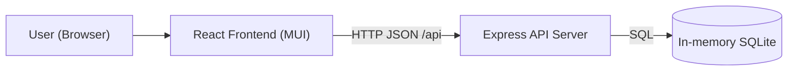
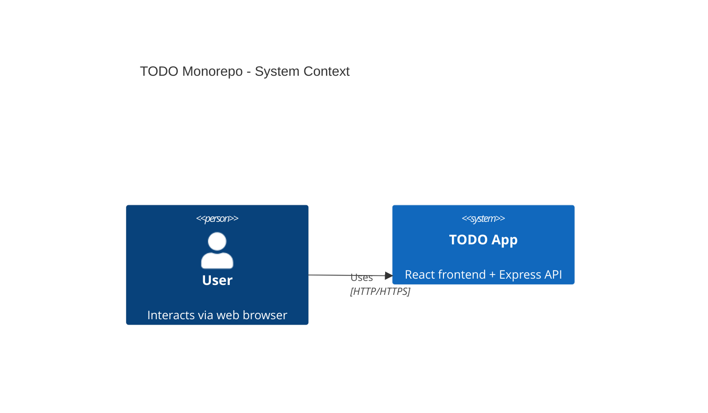
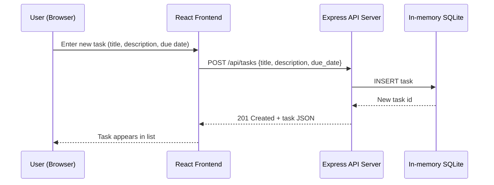

# Cloud Architecture Overview

A simple system context for the TODO monorepo.

## C4 System Context

Note: C4 diagrams in Mermaid are experimental and may not render in all viewers. If your renderer does not support C4, use the flowchart above as a portable fallback.

## Sequence: Create a TODO

